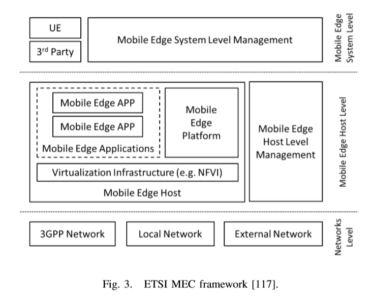

# Edge Computing相关论文阅读（一）

> 主要介绍两篇综述类论文

## 1. Right-Provisioned IoT Edge Computing: An Overview

(Great Lakes Symposium on VLSI 2019 (GLSVLSI'19) )

### 作者：
Tosiron Adegbija, Roman Lysecky, and Vinu Vijay Kumar

Department of Electrical & Computer Engineering, University of Arizona, Tucson, AZ, USA;
Google, Mountain View, CA

### 摘要：

物联网（IoT）上的边缘计算是一种越来越流行的范例，其中计算越来越靠近数据源（即边缘设备）。 边缘计算可减轻因响应时间，通信带宽，数据安全性和隐私，能源消耗等增加而导致的基于云计算的开销。但是，鉴于新兴物联网设备的潜在严格资源限制和功能要求，边缘计算绝不能**被过度或不足地配置**。 在本文中，我们概述了正确配置的IoT边缘计算问题，其中IoT设备配备了“足够”资源，即使在设计时可能没有明确定义“足够”时也是如此。 我们**重点介绍了一些研究方向和关键挑战，以实现正确配置的物联网边缘计算**。

### 内容

1. 本文所描述的边缘计算是指在边缘设备上进行计算，区别于MEC（在基站或路由器上进行计算）
2. 正确配置(right-provisioned)是指：既不使得设备性能降低又能合理利用设备资源
3. 正确配置应该是针对系统的，而不是针对应用的，因此获知系统的行为信息十分重要。而大多数物联网设备涉及一些可变性，在运行期间，应用程序、系统输入、目标功能或用户要求可能会发生巨大变化。

4. 定义：
- under-provisioned: 影响了功能/性能
- over-provisioned: 资源过剩

5. 粒度：
- task specific → application specific → domain specific → general 
  (domain-specific: 提供更好的应用程序灵活性，并且对于执行各种相似应用程序的系统而言更好。)

6. static VS dynamic

- 大多数IoT设备是静态配置的，需要提前获知整个系统的信息。静态配置适用于只执行单个应用程序或一些已知其先验特征的应用程序。

- 动态配置能够满足系统在运行过程中发生变化的要求

7. 挑战

- HLS(hign-level synthesis)

  - timing-driven low-power right-provisioned：
  为系统的各个组件选择合适的时钟域和频率，以使组合延迟小于总延迟约束，同时满足功率约束
  - 新兴的HLS方法必须提供形式化设计，合成和优化框架，以支持可精确合成的可精确计时系统模型，从而使各种不同的计算方式具有明确的综合规范
  - 这些新的HLS方法必须能够自动提取与现有的性能驱动的HLS工具/方法无缝集成所需的组件级和系统级综合约束。
  - 新的HLS方法必须支持设计方法，事件驱动的通信以及在给定系统需求和约束的情况下进行自我时钟优化以优化能耗。

- 计算卸载
  - 为了满足功能需求和系统约束，需要动态计算迁移方案来自适应地确定必须执行的计算。（协调计算开销与卸载开销）

- threat detection
- Energy efficiency 
- adaptive memories

## 2. Cost-Aware Cloudlet Placement in Edge Computing Systems

### 摘要
边缘计算中的一项众所周知的挑战是战略性放置小云。 这项挑战的基本目标是最大程度地**降低部署成本，并确保边缘服务用户的延迟最小**。 我们通过设计一种可感知成本的Cloudlet放置方法来解决此挑战，该方法可将**用户应用程序完全映射到适当的Cloudlet，同时确保其延迟要求**。 我们通过基于纽约市OpenData进行广泛的实验来研究我们提出的方法的有效性。 结果表明，我们的方法获得了接近最佳成本的解决方案，并且大大减少了执行时间。

## 3. On Multi-Access Edge Computing: A Survey of the Emerging 5G Network Edge Cloud Architecture and Orchestration

（IEEE Communications Surveys & Tutorials）

### 摘要

多访问边缘计算（MEC）是一个新兴的生态系统，旨在融合电信和IT服务，在无线电访问网络的边缘提供一个云计算平台。 MEC在边缘提供存储和计算资源，从而减少了移动最终用户的等待时间，并更有效地利用了移动回程和核心网络。 本文介绍了有关MEC的调查，重点介绍了**基本的关键支持技术**。 它在考虑单个服务和支持移动性的MEC平台网络的情况下精心设计了MEC编排，从而为不同的编排部署选项带来了光明。 此外，本文**分析了MEC参考体系结构和主要部署方案**，这些方案为应用程序开发人员，内容提供商和第三方提供了多租户支持。 最后，本文概述了当前的标准化活动，并进一步阐述了开放研究的挑战。

### 内容

#### MEC usecases and applications

1. 计算卸载
   - energy consumption
   - code partitioning
   - RAN awareness ( Gaining information on the RAN quality and user context before performing offloading can assist both the device and the network to make the best out of the MEC platform services )
2. 分布式内容交付与缓存
   - context awareness
   - pre-caching
   - popularity prediction
3. web性能增强
   - content optimization (content awareness)
   - accelerated browsing
   - web acceleration: adapting the content size dynamically
4. IoT和大数据
   -  data aggregation and big data analytics
5. 智能城市服务
6. 应用感知与内容优化 

#### MEC enabling technologies

1. cloud computing
   - 私有云、公有云等技术模型
   - Iaas、Paas、SaaS等服务模型

2. VMs and Containers
3. NFV
4. SDN
    By decoupling the control plane from the data plane and through the use of common APIs, SDN introduces a logical centralized control, which can easily instantiate and offer virtual network instances, by abstracting the underlying network infrastructure.

5. Network Slicing 
   It consists in slicing one network into multiple instances, each architected and optimized for a specific requirement and/or specific application/service

#### MEC FrameWork and architecture

#### MEC service and orchestration

orchestration 包含这些属性：
1. Resource allocation
2. Service placement
3. Edge selection
4. Reliability
5. Service mobility
   - VM migration
6. Joint optimization of VNFs and MEC services

#### MEC deployment issues in mobile networks

- Orchestration Deployment Options 
  
  

    - Open-O: 由Linux Foundation支持的一个开源项目，该项目建立了运营商级的编排平台，以跨虚拟的SDN / NFV基础架构和旧版网络提供端到端的组合服务。 OPEN-O实现了灵活性，支持多域和多位置，并通过自动化提高了服务生命周期。它还通过三个业务流程模块的层次结构缩短了上市时间，从而加快了创新速度。这种编排层次结构由（i）启用端到端服务组合和交付的Global Service Orchestrator，（ii）负责NFV编排的NFV-O组成，其中考虑了范围广泛的VNFM和VIM中的各种VNF，以及（iii ）SDNOrchestrator，它通过不同的SDN控制器（例如OpenDaylight和ONOS）和/或传统的元素管理系统来提供网络连接和流量控制。 Open-O采用TOSCA，YANG数据模型，REST API，OpenStack，并通过各种SDN，NFV和旧版网络支持资源抽象，从而提供包括策略管理，安全性和其他管理功能在内的一组通用服务.

    - ECOMP: 该项目最初由AT＆T发起，后来移交给Linux Foundation。它专注于VNF管理和提供以软件为中心的网络功能，并利用云技术和网络虚拟化的优势提供自动化服务。 ECOMP定义了一个负责自动化端到端服务实例的主服务协调器，它与三种不同的Controller类型（即通常在云层内的基础结构控制器，网络控制器和应用程序控制器）进行交互。编排自动化配置过程，可编程性规则和由策略驱动的操作管理，考虑到网络数据和面向服务的分析，在实例化，修改和终止网络，应用程序或基础架构服务和资源方面实现了灵活性。 ECOMP扩展了ETSI MANO的范围，引入了资源控制器和策略组件的概念以及资源描述的概念，即元数据，用于虚拟环境的生命周期管理，从而实现了网络的敏捷性和弹性，同时缩短了时间，市场。为此，ECOMP支持开放云标准（例如OpenStack，OPNFV和TOSCA），并遵循Netconf，Yang配置和管理模型以及REST-API。

- Open Network Automation Platform (ONAP) : Open-O与ECOMP合并。

> 《边缘计算开源平台现状分析》
> 面向物联网端：EdgeXfoundry、ApacheEdgent
> 面向边缘云：CORD、Akraino EdgeStack
> 面向云边融合：Azure IoT Edge
> 面向构建边缘计算平台：
>   - 网络管理：ONAP
>   - 容器技术：Docker
>   - 云平台： OpenStack
>   - 人工智能技术：Acumos

#### Lessions learned and research challenges

-  MEC Service Orchestration and Programmability 
-  MEC Service Continuity and Mobility
-  Service enhancements: QoE and Resiliency
-  MEC Security and Privacy 
-  MEC Service Monetization 

### 结论
MEC是一项新兴技术，它通过网络提出了边缘云计算的技术优势，并支持多租户，允许第三方通过标准化API按需提供应用程序和服务。 MEC使无线电和网络层对应用程序提供商/开发人员可见，从而在QoE上提供了一系列新的进步。 MEC被认为是5G系统的关键新兴技术之一，这归功于它对回程和核心网络中的低延迟保证和容量增强的显着贡献。 MEC的成功从根本上取决于技术与ETSI NFV ISG的一致性，以在服务弹性和生命周期管理，服务移动性以及与网络资源的联合优化方面正确定义管理和协调系统。目前，MEC提出了一系列尚未解决的挑战。但是，考虑到其潜力，很明显，MEC将极大地提升移动通信的形态和体验。

##### 下一步

进一步了解相关开源项目研究内容，结合所了解的边缘计算方向挑战，寻找可入手的点。